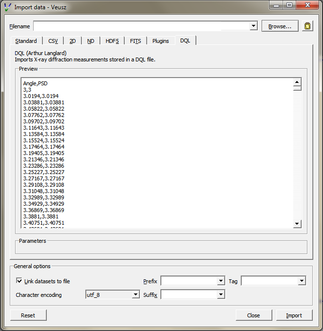

# Veusz-ImportDQL
This software is a plugin for the Veusz software. It is designed to load DQL files produced by the X-ray diffractometer D-8 Brucker. DQL files are text files containing experimental parameters and data. This plugin loads a DQL file, and imports only the information stored below the [Data] tag. Two datasets are created: one containing the 2-theta angle of diffraction and one containing the corresponding intensity of the diffracted beam.

## How to use the plugin
1. Add the plugin to the list of Veusz's plugins:
Edit -> Preferences -> Plugins -> Add. Then select the file ImportDQL.py.
Veusz has to be restarted in order to load the plugin.
2. Use the plugin:
Data -> Import -> DQL

